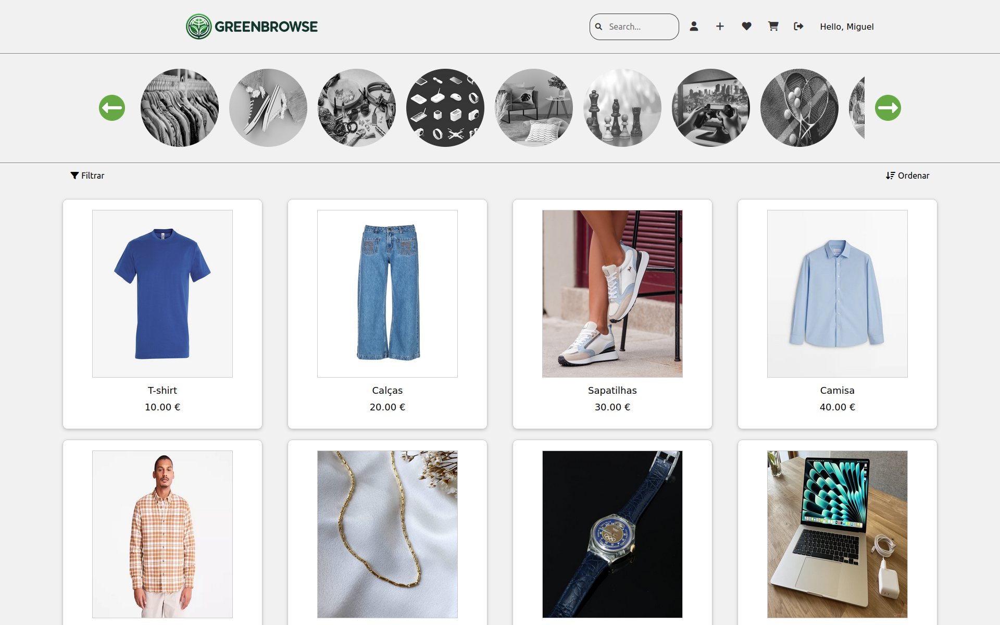
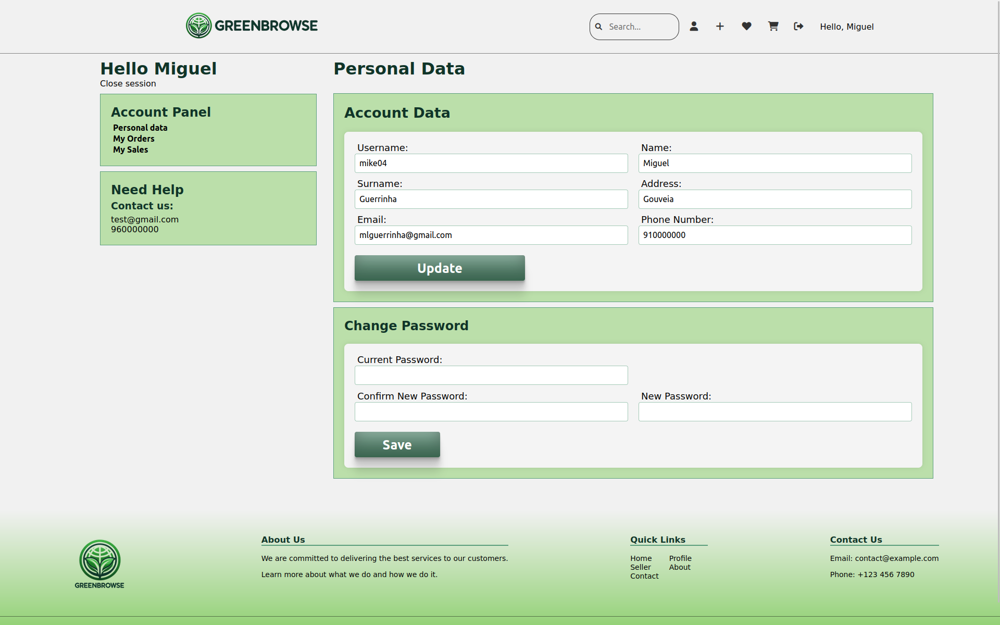
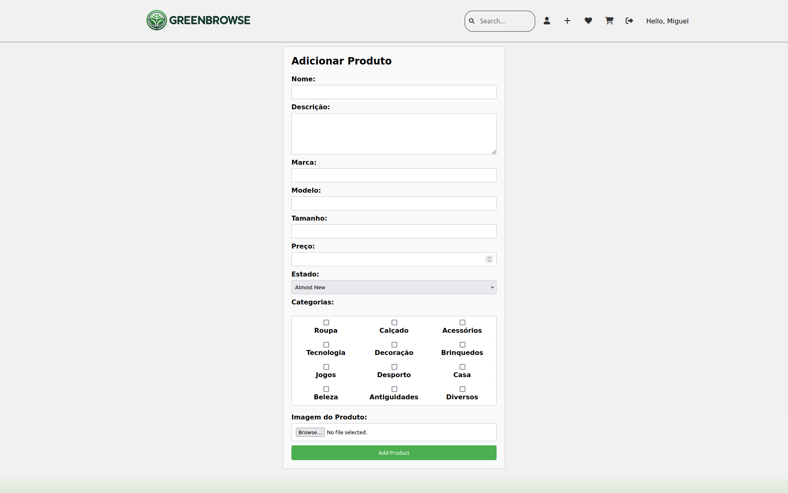

# GreenBrowse
## Grade: 14.4/20
## LTW Project -> Class 12 G05

- João Sousa | up201904739

- Miguel Guerrinha | up202205038

- Rui Cruz | up202208011

## Instructions About Installation

- git clone git@github.com:FEUP-LTW-2024/ltw-project-2024-ltw12g05.git

- git checkout final-delivery-v1

### Enter the right directory

- cd database/

- To speed up the process we created a script to do all the processes with one command: ./resetDB.sh

### If it doesn't work, follow the next steps:

#### In the terminal, execute the following commands:

- If there is already a database.db file in the directory and you want to clean up the database:  rm database.db

- sqlite3

- .open database.db

- .read database.sql

- .read insert.sql

### Return to the main directory

- cd ..

- php -S localhost:9000 (to initialize the website)

## Screenshots

### Signup

  

### Home

  

### Profile

  

### Add Product

  

## Implemented Features

**General**:
- [x] Register a new account.
- [x] Log in and out.
- [x] Edit their profile, including their name, username, password, and email.

**Sellers**  should be able to:

- [x] List new items, providing details such as category, brand, model, size, and condition, along with images.
- [x] Track and manage their listed items.
- [x] Respond to inquiries from buyers regarding their items and add further information if needed.
- [x] Print shipping forms for items that have been sold.

**Buyers**  should be able to:

- [x] Browse items using filters like category, price, and condition.
- [x] Engage with sellers to ask questions or negotiate prices.
- [x] Add items to a wishlist or shopping cart.
- [x] Proceed to checkout with their shopping cart (simulate payment process).

**Admins**  should be able to:

- [x] Elevate a user to admin status.
- [x] Introduce new item categories and other pertinent entities.
- [x] Oversee and ensure the smooth operation of the entire system.

**Security**:
We have been careful with the following security aspects:

- [x] **SQL injection**
- [x] **Cross-Site Scripting (XSS)**
- [ ] **Cross-Site Request Forgery (CSRF)**

**Password Storage Mechanism**: hash_password&verify_password

**Aditional Requirements**:

We also implemented the following additional requirements (you can add more):

- [x] **Review System**

## Comments about the Work

- User Feedback System, where operations such as adding products to the wishList or shoppingCart are accompanied by small notifications at the top left of the screen to inform the user whether the operation was successful or not.

- Admin account, which in addition to being able to elevate other users to admin, can create or remove categories and manage the rest of the system, from deleting all comments if necessary to deleting products.

- Simulation of a transaction for one or more products, where the user can choose their preferred payment method, delivery address and is then accompanied by a page where the user can save the purchase information.

- Users can search for the desired products using a search bar, the search is based on the name, brand or model of the product, a search that works simultaneously with the filters (price, condition and category) and sorting, i.e. regardless of the order of the choices, all the features work together.

- On a product page, it will always have comments associated with it, so that the buyer can communicate with the seller or give a review of the product, and only the owner of the comment or an admin can remove the comments.

- The user can, if they wish, save products they are interested in to a wishlist so that they have some way of saving them, as well as a shopping cart so that they can buy them. As for sellers in this situation, they will have all their products for sale available on their profile, and in the event of a sale, they will appear with the status "Sold".

- The seller of a product can edit all the details except the photo, category and condition of the product, as these are immutable parameters throughout the sale.

- In general, the website has a modern design, appealing to the user and easy to access, with the buttons visible and with an explicit meaning of their function.

## Technologies Used

- HTML, CSS, PHP, JavaScript, Ajax/Json, PDO/SQL
